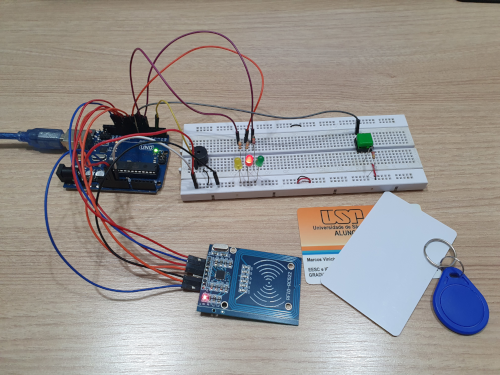

# Accestra
 Sistema de entrada/saída de membros na sala da ADA.

<h2> Descrição </h2>

O objetivo é desenvolver e instalar um sistema de abertura da porta por meio dos cartões USP, a partir da comunicação em rádio frequência (RFID).
  
<h2> Tencologias Usadas </h2>

Para compor o sistema de acesso, foi utilizado um Arduino UNO, com planos de usarmos apenas o <b>ATmega</b>. A porta é equipada com um <b>leitor de RFID</b> e um <b>botão</b> interno, enquanto a tranca será substituída por uma <b>fechadura elétrica</b> comum, acionada por um sinal elétrico enviado pelo sistema. Haverá ainda um <b>buzzer</b> para alertas sonoros e um <b>LED vermelho e outro verde</b> para indicação do estado.
 
<ul>Na programação foram utilizadas as bibliotecas
    <li>SPI</li>
    <li>MFRC522</li>
</ul>
<h2> Protótipo </h2>

<h2> Manual do Sistema </h2>

Um manual do sistema, contendo informações detalhadas sobre o código e sobre como operar estará disponível neste repostório 

<h2>Membros</h2>
<ul>
 <li>Érika Hortência</li>
 <li>Fernando Rosalini Calaza</li>
 <li>Marcos Pietrucci</li>
</ul>
<h2>Agradecimentos</h2>
<ul>
 <li>Alexandre Batistella Bellas</li>
 <li>Bruno Coulturato pelas contribuições no desenvolvimento da PCB</li>
 <li>João Marco Barros</li>
